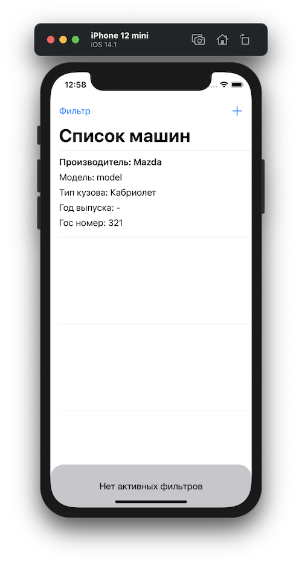
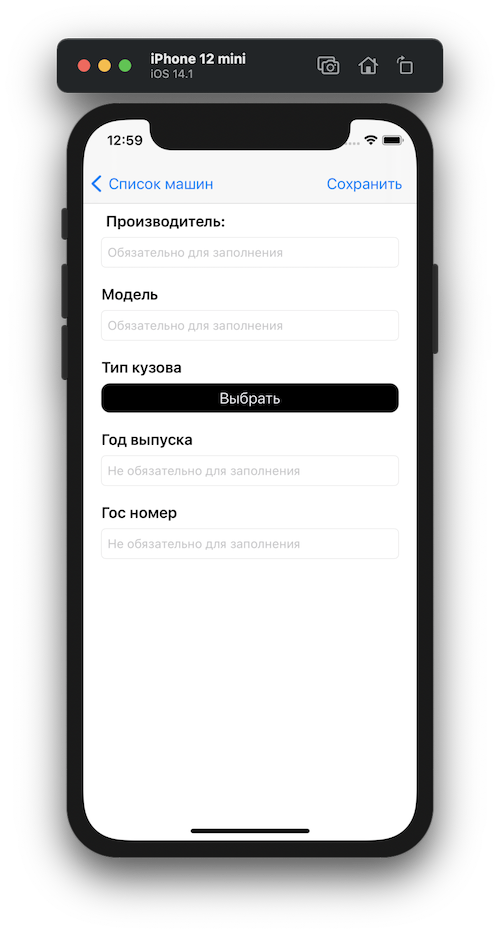

# FocusStartHomeworks
## Homework_№1:
###### Задание:

Приложение должно обладать интерфейсом взаимодействия с пользователем (меню с возможностью выбора нужного варианта).
Основные функции:
1. Добавление нового автомобиля
2. Вывод списка добавленных автомобилей
3. Вывод списка автомобилей с использованием фильтра по типу кузова
автомобиля

## Homework_№2:
###### Задание:

Необходимо реализовать потокобезопасный массив, обеспечивающий корректное изменение/получение хранимых данных.
Для демонстрации результата добавить в один concurrent queue две асинхронные задачи, в которых параллельно друг другу будет происходить добавление элементов одновременно в потокобезопасный массив и в обычный Array.
После завершения работы обеих задач, необходимо вывести в консоль (с помощью команды print) количество элементов в обычном массиве и в потокобезопасном.

Требования к потокобезопасному массиву
1. Наименование – ThreadSafeArray
2. Должен иметь возможность работать с элементами любого типа
3. Должен корректно обрабатывать хранимые значения независимо от
того, в каком потоке происходит обращение

Обязательные методы:
* append(_ item:)
* remove(at index: Int)
* subscript(index: Int) -> 
* contains(_ element:) -> Bool

Обязательные свойства: 
* isEmpty: Bool
* count: Int

## Homework_№3:
###### Задание:

Разработать приложение, состоящее из 3 экранов, каждый из которых содержится в UITabBar’e.

Первый экран:

Необходимо добавить вверху 3 лэйбла. Первый самый стандартный, с небольшим текстом, второй лэйбл большего размера и с другим шрифтом, третий лэйбл также большего размера и с другим шрифтом, но теперь в две строки всегда, при любом размере экрана.
Далее идут две кнопки, которые должны быть по-разному закруглены. Первая кнопка всегда должна быть круглой, вторая кнопка с закруглением 8.
Далее любая картинка, по центру которой должен крутится черный UIActivityIndicatorView.
Прошу заметить, что интерфейс должен быть полностью виден на размерах от 4 дюймов. Все элементы должны быть по центру, также расстояние между элементами должно увеличиваться. 1 лэйбл всегда должен быть с расстоянием 8pt до верха, изображение также с расстоянием 8pt до начала TabBar’a. Горизонтальный режим на этом экране без разницы как выглядит.

Второй экран:

Реализовать разный дизайн в портретном и горизонтальном режиме. Все элементы у нас находятся в UIScrollView, необходимо добавить так много текста, чтобы мы могли скроллить экран вверх и вниз.
В портретном изображение растягивается на всю ширину экрана и под ним находится заголовок, далее уже идет текст. В горизонтальном же режиме, изображение находится в левом верхнем углу и имеет отступы со всех сторон. Заголовок теперь идет по центру изображения, весь текст идет уже под этими двумя элементами. Определять перевернули ли устройство по Size Class’aм.

Третий экран:

Третий экран является псевдоэкраном логина, поля Login и Password являются UITextField, при вводе текста надпись Login и Password должны скрываться. Вместо обычных букв в поле Password должны быть точки при вводе.
Кнопка Enter должна уметь подниматься над клавиатурой, когда она показывается над полем login или password. Подниматься она должна через изменения его нижнего контрэинта, желательно делать это с анимацией. Также должна быть возможность тапнуть в пустом месте экрана и тогда клавиатура должна скрыться, кнопка Enter опять вернутся в исходное положение.

## Homework_№4:
###### Задание:

Разработать приложение, состоящее из UISplitViewController’a. Где в main показывается UITableView, а в detail уже картинки с тенями.

## Homework_№5:
###### Задание:

Изменить Задание №4 под различные архитектуры:
* MVP
* VIPER 
* CLEAN

## Homework_№6:
###### Задание:

1. Применить паттерн билдер для создания UI
2. Применить паттерн наблюдатель для создания некого объекта, подписчики которого
будут получать данные и как-то отображать их пользователю (к примеру генерация ошибок и их отображение)

## Homework_№7:
###### Задание:

Основной функционал: 
* Пользователь вводит произвольный url в строку поиска, в случае если он неверный или загрузка не удалась – получает ошибку.
* При успешной загрузке полученное изображение добавляется в таблицу
* Если пользователь сворачивает приложение – загрузка продолжается
Дополнительный функционал:
* При загрузке отображать прогресс в любом виде.
* Пользователь может проводить несколько параллельных загрузок одновременно
* Загрузку можно приостановить и затем возобновить с сохранением прогресса

## Homework_№8:
###### Задание:

Разработать приложение, состоящее из двух экранов. Первый – список компаний, при нажатии на компанию открывается второй – список сотрудников компании. На первом экране можно добавить компанию, на втором – отредактировать или добавить сотрудника. У сотрудника пять полей (Имя, возраст, стаж работы, образование, должность). Все данные хранятся в БД.

